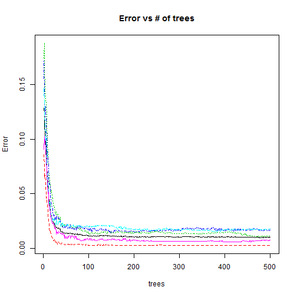

## Datasets
The training data for this project are available here: 
https://d396qusza40orc.cloudfront.net/predmachlearn/pml-training.csv

The test data are available here: 
https://d396qusza40orc.cloudfront.net/predmachlearn/pml-testing.csv

## Prediction Strategy:
Use all variables starting with "max" to predict class

## Load R packages:

```r
library(caret)
```

```
## Loading required package: lattice
## Loading required package: ggplot2
```

```r
library(knitr)
library(randomForest)
```

```
## randomForest 4.6-10
## Type rfNews() to see new features/changes/bug fixes.
```

```r
library(data.table)
```

```
## data.table 1.9.4  For help type: ?data.table
## *** NB: by=.EACHI is now explicit. See README to restore previous behaviour.
```
## Data Preparation:

```r
# Read training and testing datasets
# Delete first 7 columns in both training and test datasets
training.file <- 'pml-training.csv'
test.file     <- 'pml-testing.csv'
read.pml       <- function(x) { read.csv(x, na.strings = c("", "NA", "#DIV/0!") ) }
training       <- read.pml(training.file)
test           <- read.pml(test.file)
training       <- training[,-c(1:7)]
test           <- test[,-c(1:7)]
# Divide training dataset into 50% training and 50% testing
library(caret)
trainingIndex  <- createDataPartition(training$classe, p=.50, list=FALSE)
training.train <- training[ trainingIndex,]
training.test  <- training[-trainingIndex,]
# Next we create a function to remove entire NA columns, and apply it to both data frames. Lastly we create a function that removes any variables with missing NAs and apply this to the training dataset
rm.na.cols     <- function(x) { x[ , colSums( is.na(x) ) < nrow(x) ] }
training.train <- rm.na.cols(training.train)
training.test  <- rm.na.cols(training.test)
complete       <- function(x) {x[,sapply(x, function(y) !any(is.na(y)))] }
incompl        <- function(x) {names( x[,sapply(x, function(y) any(is.na(y)))] ) }
trtr.na.var    <- incompl(training.train)
trts.na.var    <- incompl(training.test)
training.train <- complete(training.train)
training.test  <- complete(training.test)
```

## PCA Pre-processing 

```r
preProc<-preProcess(training.train[,-53],method="pca")
trainPCA<-predict(preProc,training.train[,-53])
trainPCA$classe=training.train
testPCA<-predict(preProc,training.test[,-53])
testPCA$classe=training.test$classe
```

## Model training

```r
# Training with full data
fitFullRF<-randomForest(classe ~.,data = training.train,importance = TRUE)
predictFullRF<-predict(fitFullRF,training.test)
fullCM<-confusionMatrix(predictFullRF,training.test$classe)
fullCM$overall
```

```
##       Accuracy          Kappa  AccuracyLower  AccuracyUpper   AccuracyNull 
##      0.9934760      0.9917470      0.9916766      0.9949722      0.2844037 
## AccuracyPValue  McnemarPValue 
##      0.0000000            NaN
```

## Training Error

```r
# Training Error Vs Number of trees
plot(fitFullRF,main="Error vs # of trees")
```

 

## Apply the random forest model to test dataset.

```r
# Random Forest Model: fitFullRF<-randomForest(classe ~.,data = training.train,importance = TRUE)
Answer<-predict(fitFullRF,test)
Answer
```

```
##  1  2  3  4  5  6  7  8  9 10 11 12 13 14 15 16 17 18 19 20 
##  B  A  B  A  A  E  D  B  A  A  B  C  B  A  E  E  A  B  B  B 
## Levels: A B C D E
```


